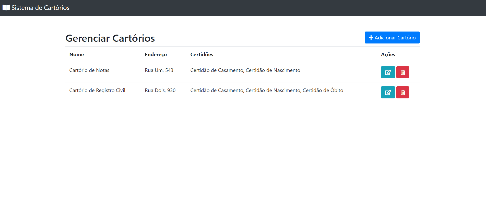

# Sistema de Cartórios

Teste para ingresso como desenvolvedor backend na Docket. Este projeto contempla um sistema de gerenciamento de cartórios por meio de uma aplicação web, bem como uma API REST.

###  Planejamento

Primeiramente foi realizada a análise dos requisitos e a confecção do Diagrama Entidade-Relacionamento (DER), de modo a representar a relação entre as entidades 'Cartorio' e 'Certidao'. Posteriormente, o desenvolvimento do projeto ocorreu de acordo com as seguintes etapas:

- [x] Organização do projeto por meio dos *packages* controller, exception, model, repository, rest, service

- [x] Criação das entidades 'Cartorio' e 'Certidao', de modo a realizar o mapeamento com as anotações do JPA

- [x] Criação de uma aplicação web para gerenciamento de cartórios, com  as seguintes interfaces:
  - [x] Interface para listar todos os cartórios e exibir suas informações básicas
  - [x] Interface  para cadastrar um novo cartório
  - [x] Interface  para editar um cartório
  - [x] Interface para remover determinado cartório

- [x] Criação de uma API REST (opcional) com todas as funcionalidades do sistema. Tais funcionalidades foram verificadas por meio de requisições HTTP no Postman

### Tecnologias

Neste projeto foram utilizadas as seguintes tecnologias:

- Java 11
- Spring Boot
- Spring MVC
- Spring Data JPA
- Bean Validation
- Lombok
- Thymeleaf
- HTML
- Bootstrap
- HD2B
- PostgreSQL

### Aplicação WEB

As funcionalidades do sistema, referentes às operações de CRUD, estão representadas a seguir. Nota-se as seguintes validações no backend ao tentar criar ou editar determinado cartório: um cartório deve possuir um nome, um endereço e emitir pelo menos uma certidão.

### API REST

| Verbo HTTP |                Resource path                |                          Descrição |
| ---------- | :-----------------------------------------: | ---------------------------------: |
| POST       |            /api/cartorios/salvar            |                   Cria um cartório |
| PUT        |         /api/cartorios/editar/{id}          |               Atualiza um cartório |
| GET        | /api/listaCertidoesRelacionadasComCartorios | Certidões e cartórios relacionados |
| GET        |               /api/cartorios                |                 Lista de cartórios |
| DELETE     |         /api/cartorios/remove/{id}          |                 Deleta um cartório |

